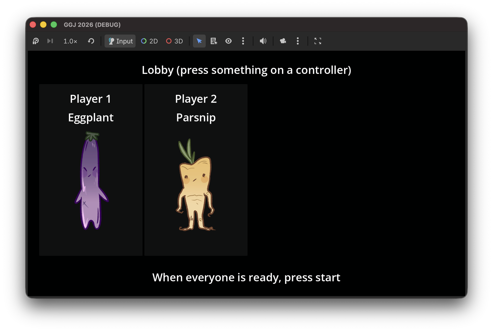
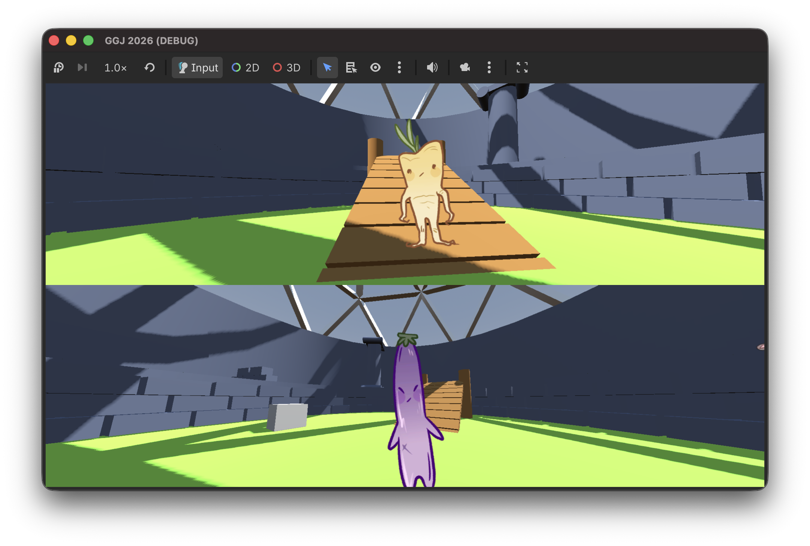

Vernal Visages is my submission to [Global Game Jam 2026](https://globalgamejam.org/jam-sites/2026/vancouver-island-game-devs-nanaimo). It is a split-screen arena shooter where players pick up masks to grant them abilities in battle. This year I teamed up again with my favourite co-developer, Alister. We also had the help of additional team members [Nolan](https://github.com/NolanMeske) (programming and music) and Jordan (art). I enjoyed working with a larger team, especially since we utilized version control effectively.

## 🔗 Links

- [Submission page](https://globalgamejam.org/games/2026/vernal-visages-9)

## 🏞️ Images

## 👨‍💻 Process

The theme of this year's GGJ was mask. A quick brainstorming session surfaced the idea of an arena shooter where masks grant abilities. We also wanted to have the masks obscure the player's vision, with more powerful masks being harder to see through "for balance". Unfortunately (or maybe fortunately as this quirk might have sucked), we didn't have this functionality in our completed demo.

We wanted Vernal Visages to have simple retro-fps style gameplay, and since we also had a good artist on our team this time, we decided to use 2D sprites for the characters and masks. We wanted to make the sprites billboard, or face the camera, and change perspective based on which direction you viewed them from. However, we ran into issues with this approach as there were multiple cameras in the same local scene and it was difficult to figure out how to rotate them per player view. Instead, we decided to make the sprite rotate with the player view because we thought it was funny, which had the effect of making the players invisible from a side profile.

## 🎓 Lessons Learned

I think the most important lesson I learned from this project is one I thought I'd learned before: **Watch your scope!** We knew going into this project that a split screen arena shooter was a lot to do in a two-day game jam, but there wasn't much on the line and we were passionate about the project. Still, I think that next year I'd like to make a simpler game and see how polished I can make it before submission.
